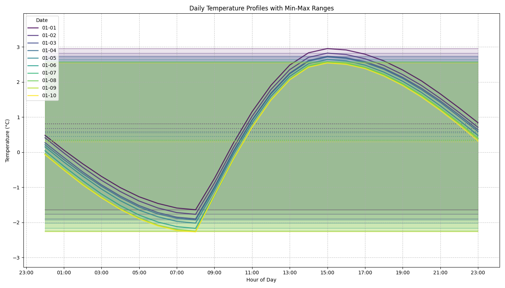

# Analyzing Historical Temperature Data

This document outlines the process of analyzing historical temperature data using HYRAS datasets and 10-minute station measurements from weather stations in Germany. The process involves fetching data, preprocessing it, calculating climate metrics, and ultimately generating interpolated hourly temperature profiles based on historical averages.

## Overview of the Process

The analysis follows these major steps:
1. Fetch current 10-minute station data
2. Extract and process station data
3. Fetch historical HYRAS climate data
4. Extract climate metrics from HYRAS data
5. Filter station data based on HYRAS grid availability
6. Calculate rolling averages over multiple years
7. Interpolate hourly temperatures for each station based on min and max values

## Detailed Steps

### 1. Fetch 10-minute Station Data

The process begins by fetching the latest 10-minute interval data from weather stations. Interpolated hourly temperatures are later calculated for most of these weather stations.

```bash
python analysis/stations/fetch_station_data.py --granularity 10min --type now --output-dir ./data/10min_station_data/now
```

**What it does:**
- Connects to the weather data source (DWD - German Weather Service)
- Downloads the latest 10-minute observation data
- Stores raw data files in the specified output directory

### 2. Extract 10-minute Station Data

Next, the raw station data files are processed and combined into a single dataset.

```bash
python analysis/stations/extract_10min_station_data.py --data-dir ./data/10min_station_data/now --output-file ./data/10min_station_data/unfiltered_10min_station_data.csv --reference-date 20250618 --invalid-value -999
```

**What it does:**
- Reads all station data from the specified directory
- Filters out invalid measurements (marked with the invalid value)
- Processes data for the reference date
- Combines data from all stations into a single CSV file

### 3. Fetch HYRAS Data

HYRAS (Hydrometeorologischer Rasterdatensatz) is a gridded dataset containing historical climate data for Germany. This step fetches specific climate parameters.

```bash
python analysis/hyras/fetch_hyras_data.py --dataset air_temperature_max --start-year 1960 --end-year 1991 --resolution 5 --output-dir ./data/hyras
python analysis/hyras/fetch_hyras_data.py --dataset air_temperature_min --start-year 1960 --end-year 1991 --resolution 5 --output-dir ./data/hyras
```

**What it does:**
- Connects to the HYRAS data source
- Downloads historical climate data files for the specified dataset (e.g., maximum air temperature)
- Covers the requested time period (1960-1991)
- Uses the specified spatial resolution (5km grid)
- Stores data as NetCDF files in the output directory

### 4. Extract HYRAS Climate Metrics

This step processes the HYRAS NetCDF files to extract relevant climate metrics for each station location.

```bash
python analysis/hyras/extract_hyras_data.py --file ./data/hyras/tasmin_hyras_5_{1960-2011}_v5-0_de.nc --file ./data/hyras/tasmax_hyras_5_{1960-2011}_v5-0_de.nc --stations ./frontend/public/10min_station_data.csv --output-dir ./data/10min_station_data/hyras --param tasmin --param tasmax
```

**What it does:**
- Reads the specified HYRAS NetCDF files containing different climate parameters
  - `tasmin`: Minimum air temperature
  - `tasmax`: Maximum air temperature
- Maps these gridded values to station locations
- Extracts historical climate data for each station
- Stores the results in the output directory

### 5. Filter 10-minute Station Data Available in HYRAS Grid

This step filters the station data to include only stations that are covered by the HYRAS grid.

```bash
python analysis/stations/filter_10min_station_data_by_hyras.py --station-data ./data/10min_station_data/unfiltered_10min_station_data.csv --reference-file ./data/10min_station_data/hyras/hyras_stations.csv --output-file ./data/10min_station_data/10min_station_data.csv
```

**What it does:**
- Cross-references the unfiltered station data with the HYRAS station list
- Keeps only stations that have corresponding HYRAS climate data
- Creates a filtered station dataset

### 6. Calculate Rolling Averages Over Years

This step calculates rolling averages of climate metrics over multiple years, creating a historical climate profile.

```bash
python analysis/rolling_average/calculate_rolling_average.py --data-dir ./data/10min_station_data/hyras --output-dir ./data/10min_station_data/rolling_average/1981_2010 --from-year 1981 --to-year 2010 --rolling-window 7 --over-years
```

**What it does:**
- Processes historical climate data from the HYRAS dataset
- Calculates 7-day rolling averages for climate metrics
- Calculates these averages across multiple years (1981-2010)
- Creates a climatological normal (baseline) for each station
- This provides a smooth representation of typical conditions for each calendar day

### 7. Interpolate Hourly Temperatures for HYRAS Stations

The final step creates hourly temperature profiles for each station based on the rolling average climate data.

```bash
python analysis/stations/interpolate_hourly_temperatures_for_stations.py --input-file ./data/10min_station_data/10min_station_data.csv --hyras-stations ./data/10min_station_data/hyras/hyras_stations.csv --hyras-data ./data/10min_station_data/rolling_average/1981_2010/yearly --output-dir ./data/10min_station_data/rolling_average/1981_2010/yearly/interpolated_hourly_temperatures --output-prefix interpolated_hourly_temperatures_1981_2010
```

**What it does:**
- Reads station metadata and daily climate metrics
- For each day and station, calculates:
  - Sunrise and solar noon times based on geographic coordinates
  - Temperature peak time (typically 2 hours after solar noon)
- Interpolates a 24-hour temperature profile using:
  - Midnight to sunrise: Cosinusodial cooling from previous day's maximum temperature toward current day's minimum temperature
  - Sunrise to peak time: Sinusoidal warming from current day's minimum to maximum temperature
  - Peak time to midnight: Cosinusodial cooling from current day's maximum temperature to next day's minimum temperature
- Outputs hourly temperature profiles for each day of the year and each station

## Visualization of Interpolated Daily Temperature Profiles

The interpolated hourly temperatures create a realistic diurnal temperature cycle that accounts for:
- Daily minimum and maximum temperatures
- The timing of sunrise and solar noon for the station's location
- Seasonal variations in daylight hours
- The different warming and cooling patterns throughout the day



The image shows interpolated temperature profiles for the first ten days of January, with each day represented by a different colored line. The shaded areas represent the min-max temperature ranges for each day. The curves clearly show how the temperature rises after sunrise, peaks in the early afternoon (approximately 2 hours after solar noon), and then gradually decreases into the evening and night.

## Conclusion

This process generates interpolated hourly temperature profiles based on historical climate data, but it comes with significant limitations. The method represents a compromise necessitated by data constraints rather than an ideal approach. Several important limitations should be acknowledged:

- It's important to note that these historical means are themselves derived from HYRAS data, which is already an interpolated gridded dataset—creating yet another layer of abstraction from actual measured temperatures. The HYRAS dataset interpolates point measurements from weather stations onto a regular grid, introducing its own set of approximations before our hourly interpolation process even begins
- The interpolation method uses simplistic sinusoidal and cosinusoidal curves that only approximate real temperature patterns
- Actual temperature variations are influenced by many factors not captured here (cloud cover, precipitation, wind, etc.)
- Using fixed timing offsets from solar noon for temperature peaks ignores day-to-day weather variations
- The approach cannot account for microclimate effects or urban heat islands
- Historical data at hourly resolution would be far superior if available

Ideally, we would use actual historical hourly measurements rather than interpolated values. However, such data is not readily available for the required time span and geographical coverage. This approach represents a practical compromise given the data constraints.

On the website, these interpolated hourly values are used to compare live temperature data from each weather station to the historical mean for that specific day and time (calculated over the reference period, e.g., 1961-1990). This allows visitors to see how current temperatures deviate from what would be "typical" for that location, date, and time of day based on historical climate records.

While imperfect, this double-interpolated method provides a workable approximation for communicating relative temperature anomalies to the public when perfect historical data is unavailable. Users should be aware that they are seeing a comparison to a simplified model of historical temperature patterns rather than to actual historical measurements at each location and time.